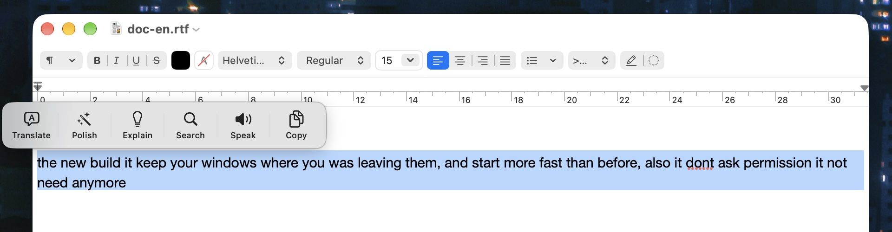

<h1 align="center">
  <br/>
  QDuo
</h1>

<p align="center">
  <b>Select text in any app, and your own actions appear right at the cursor — translate, polish, search, speak, transform, or ask a model, and put the result straight back.</b>
</p>

<p align="center">
  <b>🇺🇸 English</b> •
  <a href="README_CN.md">🇨🇳 中文</a>
</p>

<p align="center">
  <a href="https://github.com/XueshiQiao/qduo/actions/workflows/build.yml"></a>
  <a href="https://github.com/XueshiQiao/qduo/releases/latest"></a>
  <a href="LICENSE"></a>
  
  <a href="https://github.com/XueshiQiao/qduo/stargazers"></a>
</p>

<p align="center">
  ⭐ <b>If QDuo saves you a few trips to the clipboard, please <a href="https://github.com/XueshiQiao/qduo">star the repo</a></b> — it helps others find it.
  <br/>
  ✨ <a href="https://xueshi.dev">More apps I made → xueshi.dev</a>
</p>

Select some text — in a browser, a chat, an editor, a PDF — and a small popup appears
at the cursor with the actions **you** set up. Tap one and it happens right there: no
copying, no switching apps, no pasting back.



## ✨ Features

### 🫧 A popup where you already are

- **Two shapes** — a capsule bar above the selection, or a ring centred on the cursor
  (classic or Liquid Glass). On the ring, a **group** unfolds into a second ring.
- Works in native apps, browsers and Electron apps; falls back to a clipboard read
  where an app hides its text, and puts your clipboard back afterwards.
- **Screenshot text** — press a hotkey, drag a box over anything on screen, and the
  recognised text comes up in the same popup.

### 🤖 AI actions you write

- Every AI action is a prompt of your own: translate, polish, explain, summarize, fix
  grammar, change tone, break down a sentence, explain code…
- Answers **stream in** as formatted text.
- **DeepSeek, OpenAI, Doubao, Qwen and Ollama** built in, or any OpenAI-compatible
  endpoint via the base URL. Pick a model **per action** if you like. API keys live in
  the macOS Keychain.

### 🧰 Actions beyond AI

| Kind | What it does |
|---|---|
| **Open URL** | Fill `{text}` into any address — Google, Baidu, Wikipedia, GitHub, the system dictionary (`dict://`), Maps, Obsidian, "ask ChatGPT / Claude"… |
| **Speak** | Read the selection aloud in a system voice that matches its language |
| **Transform** | 22 local text operations: change case, camelCase / snake_case, sort / dedupe lines, join PDF line breaks, Simplified ↔ Traditional Chinese, pinyin, spacing between CJK and Latin, format / minify JSON, URL encode / decode, strip link tracking, word count |
| **Shortcut** | Hand the selection to one of your Shortcuts |
| **Shell script** | Pipe it through a command; asks before a script runs for the first time |

**Settings → Actions → Add from Template** has all of these ready-made.

### ↩️ Put the result back

A result can **replace the selection**, go **after** it, or go to the **clipboard** —
per action, or with the Replace button on the result panel. QDuo only writes where it
can confirm the selection is still where you left it; anywhere else it copies the
result and tells you why.

### 🛠️ More

- **Menu bar only** — no Dock icon.
- **One readable settings file** — `~/.config/qduo/config.json`, with a JSON Schema
  beside it, safe to keep in your dotfiles (keys stay in the Keychain).
- **152 icons** to choose from, and tags in the action list that flag what matters:
  AI, a missing key, a script, and where the result goes.
- **English / 简体中文** interface.
- **Auto-update** via [Sparkle](https://sparkle-project.org).
- **Privacy first** — optional anonymous usage stats that never include selected text,
  paths or personal data. Text goes to a model only when you tap an AI action.

## Usage

1. Launch QDuo — it lives in your menu bar.
2. Grant **Accessibility** when asked (see below).
3. Select text anywhere; the popup appears at the cursor. Tap an action.
4. For AI actions, add an API key in **Settings → AI Models**.
5. Add, reorder and group actions in **Settings → Actions**, or start from a template.

## Install

### Homebrew

```bash
brew install --cask XueshiQiao/tap/qduo
```

<details>
<summary>Prefer the two-step form?</summary>

```bash
brew tap XueshiQiao/tap
brew trust XueshiQiao/tap   # Homebrew 6.0+; earlier versions can skip this line
brew install --cask qduo
```

Since Homebrew 6.0 a cask from a third-party tap will not load unless the tap is
trusted — or the cask is named in full on the command line, which is exactly what
the one-liner above does.
</details>

Or download `QDuo.dmg` from [GitHub Releases](https://github.com/XueshiQiao/qduo/releases)
and drag QDuo into your Applications folder.

The app is signed with an Apple Developer ID certificate and notarized by Apple, so it
installs without any security warnings.

### Permissions

- **Accessibility** (required) — to read the selected text and notice when you select
  something: `System Settings → Privacy & Security → Accessibility`.
- **Screen Recording** (optional) — only for screenshot text:
  `System Settings → Privacy & Security → Screen & System Audio Recording`.

QDuo is not sandboxed: reading another app's selection and watching the mouse
globally are both impossible inside the App Sandbox.

## Build from Source

See [DEVELOPMENT.md](DEVELOPMENT.md).

## License

GPL v3.0 — see [LICENSE](LICENSE).
