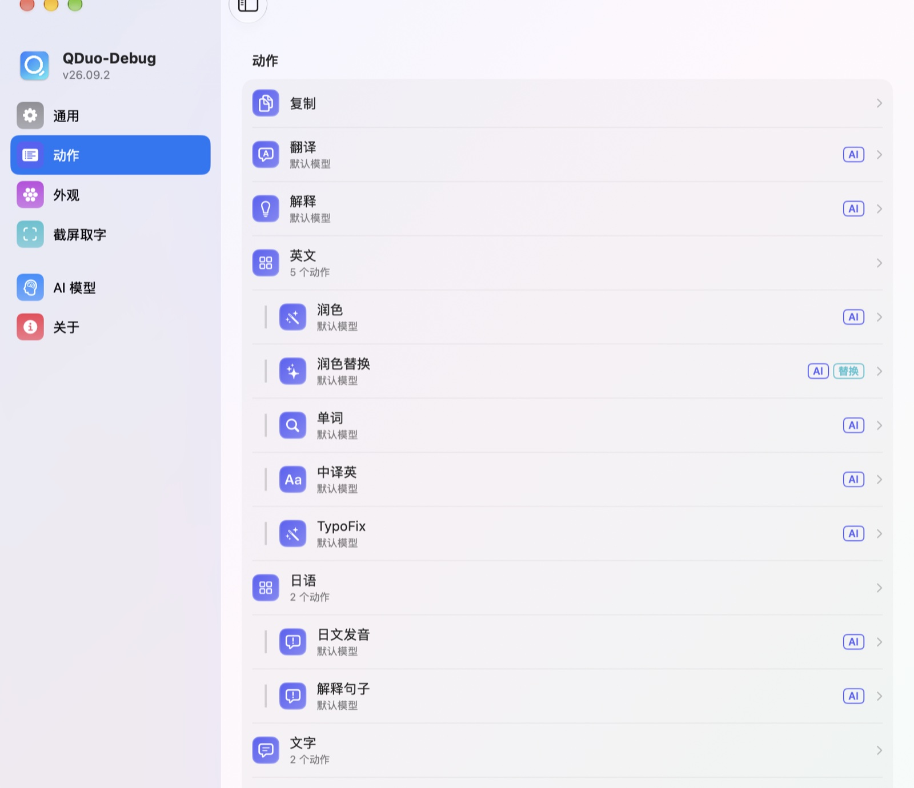

<h1 align="center">
  <br/>
  QDuo
</h1>

<p align="center">
  <b>在任何 app 里选中文字，你自己设置的动作就出现在光标旁：翻译、润色、搜索、朗读、处理文本、问大模型，结果还能直接放回原处。</b>
</p>

<p align="center">
  <a href="README.md">🇺🇸 English</a> •
  <b>🇨🇳 中文</b>
</p>

<p align="center">
  <a href="https://github.com/XueshiQiao/qduo/actions/workflows/build.yml"></a>
  <a href="https://github.com/XueshiQiao/qduo/releases/latest"></a>
  <a href="LICENSE"></a>
  
  <a href="https://github.com/XueshiQiao/qduo/stargazers"></a>
</p>

<p align="center">
  ⭐ <b>如果 QDuo 帮你少复制粘贴了几次，欢迎<a href="https://github.com/XueshiQiao/qduo">点个 Star</a></b>，能让更多人发现它。
  <br/>
  ✨ <a href="https://xueshi.dev">我做的其他 app → xueshi.dev</a>
</p>

在浏览器、聊天软件、编辑器、PDF 里选中一段文字，光标旁就会弹出一个小窗，里面是**你自己**设置的动作。点一下，事情就在原地办完：不用复制，不用切 app，也不用再粘贴回去。


## ✨ 功能

### 🫧 就在你正在用的地方弹出

- **两种样式**：选区上方的胶囊条，或者围着光标的一圈圆环（经典 / Liquid Glass 两种外观）。圆环样式下，一个**分组**会展开成第二圈。
- 原生 app、浏览器、Electron 应用里都能用；遇到不开放文字的 app，会改用剪贴板读取，读完把你原来的剪贴板放回去。
- **截屏取字**：按快捷键，框选屏幕上任意一块区域，识别出的文字出现在同一个弹窗里。

### 🤖 自己写的 AI 动作

- 每个 AI 动作就是你写的一段提示词：翻译、润色、解释、总结、语法纠错、改语气、句子解析、解释代码……
- 回答**边生成边显示**，带格式。
- 内置 **DeepSeek、OpenAI、豆包、通义千问、Ollama**，也可以改 Base URL 接任何兼容 OpenAI 的服务。每个动作可以单独选模型。API Key 存在 macOS 钥匙串里。

### 🧰 不只是 AI 的动作

| 类型 | 做什么 |
|---|---|
| **打开网址** | 把 `{text}` 填进任意网址：Google、百度、维基百科、GitHub、系统词典（`dict://`）、地图、Obsidian、「问 ChatGPT / Claude」…… |
| **朗读** | 用和文字语言相符的系统声音读出来 |
| **文本处理** | 22 种本地操作：大小写、camelCase / snake_case、按行排序 / 去重、合并 PDF 断行、繁简转换、拼音、中英文之间加空格、格式化 / 压缩 JSON、URL 编码 / 解码、去掉链接跟踪参数、统计字数 |
| **快捷指令** | 把选中的文字交给你的某个快捷指令 |
| **Shell 脚本** | 让文字经过一条命令处理；脚本第一次运行前会先问你 |

**设置 → 动作 → 从模板添加** 里这些都有现成的。

### ↩️ 结果放回原处

结果可以**替换选中的文字**、**插到后面**，或者**放进剪贴板**：可以按动作设置，也可以在结果面板上点「替换」。只有确认选区还在原来的位置时，QDuo 才会写入；否则它会把结果复制到剪贴板，并告诉你原因。

### 🛠️ 其他

- **只在菜单栏**，没有 Dock 图标。
- **一个看得懂的设置文件**：`~/.config/qduo/config.json`，旁边附带 JSON Schema，可以放进你的 dotfiles 仓库（密钥都在钥匙串里）。
- **152 个图标**可选；动作列表里的标签只标值得注意的：AI、缺 API Key、脚本，以及结果去哪。
- 界面支持**简体中文 / English**。
- 通过 [Sparkle](https://sparkle-project.org) **自动更新**。
- **隐私优先**：匿名使用统计可以关闭，而且从不包含选中的文字、路径或个人信息。只有你点了 AI 动作，文字才会发给大模型。

## 使用

1. 打开 QDuo，它会出现在菜单栏里。
2. 按提示授予**辅助功能**权限（见下文）。
3. 在任何地方选中文字，光标旁就会弹出动作，点一个即可。
4. 用 AI 动作前，在 **设置 → AI 模型** 里填上 API Key。
5. 在 **设置 → 动作** 里添加、排序、分组动作，也可以从模板添加。

## 安装

### Homebrew

```bash
brew install --cask XueshiQiao/tap/qduo
```

<details>
<summary>想分两步装？</summary>

```bash
brew tap XueshiQiao/tap
brew trust XueshiQiao/tap   # Homebrew 6.0 及以上需要这一步，更早的版本可以跳过
brew install --cask qduo
```

从 Homebrew 6.0 开始，第三方 tap 里的 cask 必须先被信任才能加载，或者像上面那条一行命令那样写全名。
</details>

也可以从 [GitHub Releases](https://github.com/XueshiQiao/qduo/releases) 下载 `QDuo.dmg`，把 QDuo 拖进「应用程序」文件夹。

App 用 Apple Developer ID 证书签名，并经过苹果公证，安装时不会有安全警告。

### 权限

- **辅助功能**（必需）：用来读取选中的文字、知道你什么时候选中了东西。位置：`系统设置 → 隐私与安全性 → 辅助功能`。
- **录屏**（可选）：只有截屏取字要用。位置：`系统设置 → 隐私与安全性 → 录屏与系统录音`。

QDuo 没有启用沙盒：读取别的 app 里选中的文字、全局监听鼠标，这两件事在 App 沙盒里都做不到。

## 截图



## 从源码构建

见 [DEVELOPMENT.md](DEVELOPMENT.md)。

## 许可证

GPL v3.0，见 [LICENSE](LICENSE)。
